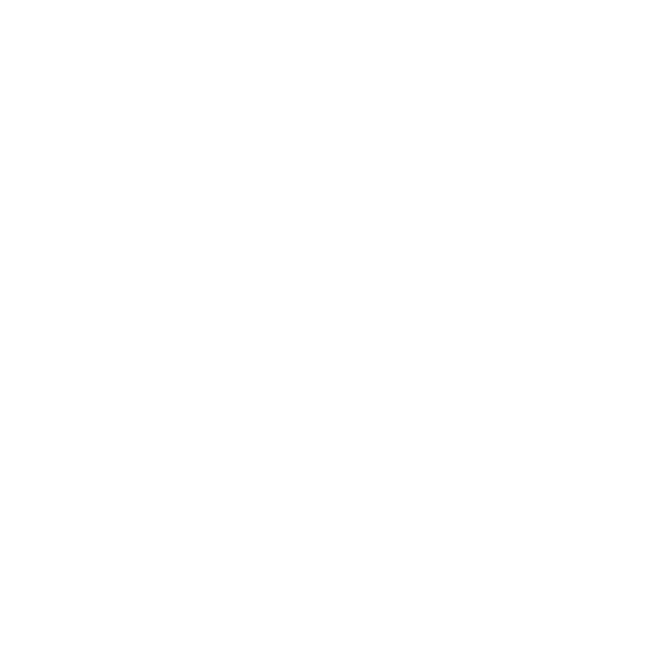

 

 

  

 

This repository contains a <strong>Tandem Repeat Visualization Tool</strong> designed using Streamlit. The tool processes Variant Call Format (VCF) files, visualizing tandem repeats in an intuitive, interactive format. Users can explore motifs, compare alleles, and gain insights into the structure of tandem repeats, enhancing their ability to interpret genomic variation.

<h2>Why ProleTRact?</h2>

TRs are complex: alleles can differ by motif composition, length, and interrupted blocks. ProleTRact renders TR regions with color-coded motifs, highlights interruptions, and provides intuitive navigation across variants and samples, enabling quick insight into potentially pathogenic expansions or atypical structures.

<h2>Key Features</h2>
<ul>
  <li><strong>Individual and Cohort modes:</strong> Analyze a single VCF or an entire directory of VCFs.</li>
  <li><strong>Dynamic sequence visualization:</strong> Color-coded motifs, clear interruption highlighting, and side-by-side allele comparison.</li>
  <li><strong>Pathogenic TR reference overlay:</strong> Built-in <code>pathogenic_TRs.bed</code> provides context for known loci (disease, gene, thresholds).</li>
  <li><strong>Fast navigation:</strong> Move across TR records with Previous/Next controls or jump to a specific region.</li>
  <li><strong>Streamlit-native UI:</strong> Clean controls, responsive layout, and helpful tooltips.</li>
</ul>

<h2>Demo / Examples</h2>

Example screenshots and short walkthrough GIFs will be added here. For now, you can open <code>example.svg</code> for a preview:

<ul>
  <li><em>Planned:</em> Individual-mode walkthrough (loading one bgzipped+tabix-indexed VCF and navigating records)</li>
  <li><em>Planned:</em> Cohort-mode walkthrough (loading a directory of VCFs and comparing across samples)</li>
</ul>

<h2>Installation</h2>
<ol>
  <li>Clone the repository:
    <pre><code>git clone git@github.com:Lionward/ProleTRact.git
cd ProleTRact</code></pre>
  </li>
  <li>Ensure you have Python 3.9+ and <code>pip</code> installed.</li>
  <li>Install dependencies (no <code>requirements.txt</code> yet; install directly):
    <pre><code>pip install streamlit pysam pandas matplotlib altair plotly</code></pre>
  </li>
</ol>

<h2>Quickstart</h2>
<ol>
  <li>Run the app from the repository root:
    <pre><code>streamlit run app.py</code></pre>
  </li>
  <li>(Optional) If running on a remote machine, forward the web UI port to your laptop:
    <pre><code>ssh -L 8501:localhost:8501 &lt;your_remote_host&gt;</code></pre>
    then open <code>http://localhost:8501</code> in your browser.
  </li>
</ol>

<h2>Usage</h2>
<h3>Individual mode 👤</h3>
<ol>
  <li>Select <strong>individual sample</strong> in the sidebar.</li>
  <li>Provide the absolute path to a bgzipped and tabix-indexed VCF (<code>.vcf.gz</code> with <code>.tbi</code>):
    <ul>
      <li>Enter the path in the sidebar input, then click <strong>Upload VCF File</strong>.</li>
      <li>The app will parse records and enable navigation across TR variants.</li>
    </ul>
  </li>
  <li>Use <strong>Previous</strong>/<strong>Next</strong> to step through records or jump to a region like <code>chr1:1000-2000</code>.</li>
  <li>Inspect motif blocks, interruptions, and per-allele differences.</li>
</ol>

<h3>Cohort mode 👥👥</h3>
<ol>
  <li>Select <strong>Cohort</strong> in the sidebar and choose <em>Reads-based VCF</em> or <em>Assembly VCF</em> view.</li>
  <li>Provide the absolute path to a directory containing bgzipped+tabix-indexed VCF files:</li>
  <li>Click <strong>Load Cohort</strong> to scan the directory and enable cohort navigation.</li>
  <li>Browse records and compare across files; summaries/visuals are rendered per record.</li>
</ol>

<h2>Input Requirements</h2>
<ul>
  <li><strong>VCF format:</strong> Standard VCF handled via <code>pysam.VariantFile</code> (must be <code>.vcf.gz</code> with an accompanying <code>.tbi</code> index).</li>
  <li><strong>Content:</strong> ProleTRact expects TR variants. Record IDs and coordinates are used to drive navigation (e.g., <code>rec.id</code>, <code>rec.chrom</code>, <code>rec.pos</code>, <code>rec.stop</code>).</li>
  <li><strong>Cohort directory:</strong> A folder with multiple <code>.vcf.gz</code> files is required for cohort mode.</li>
  <li><strong>Optional reference:</strong> <code>proletract/data/pathogenic_TRs.bed</code> is loaded to annotate known loci with disease/gene/thresholds.</li>
</ul>

<h2>Tips</h2>
<ul>
  <li>Use absolute paths in the sidebar inputs.</li>
  <li>Ensure files are bgzipped (<code>bgzip</code>) and indexed (<code>tabix</code>) before loading.</li>
  <li>Large cohorts: keep only relevant TR VCFs in the directory you point to for faster scanning.</li>
</ul>

<h2>Roadmap</h2>
<ul>
  <li>Screenshots and GIF walkthroughs for both modes</li>
  <li>Requirements file and optional Conda environment</li>
  <li>Enhanced cohort summaries and export options</li>
</ul>

<h2>Contributing</h2>

Contributions are welcome! Please open an issue to discuss changes, or submit a PR with a clear description and minimal repro. For larger changes, propose an approach first.

<h2>License</h2>

This project is licensed under the MIT License — see <code>LICENSE</code> for details.

<h2>Citation</h2>

If you use ProleTRact in your work, please cite this repository. A formal citation entry will be added once available.

